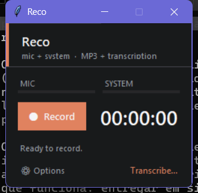

# Reco

**Record your microphone *and* your computer's audio at the same time, then transcribe it locally — with speaker separation.**

A small desktop app that captures the mic and the system output together
(real WASAPI loopback — no "Stereo Mix" needed), saves a compact MP3, and
transcribes it **on your machine**, labeling who said what. Nothing is uploaded.
The interface is bilingual (Portuguese / English), auto-detected from your system.

Transcription runs in-process via **OpenVINO GenAI** on Windows/Linux (Intel
**NPU → iGPU → CPU**, auto-selected) and via **MLX** on macOS Apple Silicon — so
the bundled app is fully self-contained (no Python, no ffmpeg).

<p align="center">
  
</p>

---

## English

### Features
- 🎙️ **Mic + system audio together** — capture a call/meeting with both sides, via
  true WASAPI loopback (works even when "Stereo Mix" is disabled).
- 🗣️ **Channel diarization** — the mic and the system are kept on separate channels,
  so the transcript is labeled **"Eu" / "Me"** (you) and **"Interlocutor(es)" /
  "Speaker(s)"** (the other side). Always on.
- 🔇 **Echo cancellation** — if you're on speakers, the PC audio leaking into the
  mic is removed (offline adaptive filter using the loopback as reference), so the
  other party isn't duplicated across both channels.
- 📊 Live level meters for mic and system.
- ⏸️ **Pause / resume** a recording before saving — paused time is dropped from the
  audio and from the clock, so a break doesn't end up in the file.
- 🔔 **Lives in the tray** — closing the window hides Reco into the notification area
  (a recording keeps running, and the icon shows a red dot with the elapsed time).
  **Hover** the icon to bring the compact window back over the tray (stop, start,
  convert, transcribe); **click** to pin it; **right-click** for Record/Stop,
  Pause/Resume, Open and Quit. Quitting mid-recording saves the MP3 first.
- 🎧 Saves a compact **MP3** (16 kHz stereo, 128 kbps VBR — small, plenty for speech).
- 📝 **Local transcription** that auto-saves a `.txt` next to your recordings. No
  cloud, fully private.
- 🎵 **MP4 → MP3** — pick a video (or a heavy audio file) in the Transcribe view and
  hit *Extract MP3*: it re-encodes to the same lightweight format Reco records in
  (16 kHz mono, 64 kbps VBR), typically a fraction of the original size. The MP3 is
  saved next to the source and stays selected, ready to transcribe.
- 🌐 **Bilingual UI** (PT/EN), auto-detected, switchable in Options.
- 🎨 **Custom theme** — pick background and accent colors in Options; text contrast
  adjusts automatically. Frameless window with its own title bar.
- ▶️ Play back the last recording. Record and Transcribe are one-or-the-other views.

> Windows 10/11 (uses WASAPI). Recordings are saved to `Documents\Reco` (changeable in Options).

### Run from source
```powershell
pip install -r requirements.txt
python reco.py
```
Or run `./setup.ps1` to install the dependencies. The optional **Ctrl+Shift+R**
keyboard shortcut is *opt-in* — enable it inside Reco under **Options** (never
created automatically).

Required: `soundcard`, `numpy`, `lameenc`, `scipy`, `av`, `huggingface_hub`.
Transcription backend: `openvino` + `openvino-genai` + `openvino-tokenizers`
(Windows/Linux), or `mlx-whisper` (macOS Apple Silicon).

### Build a standalone app
```powershell
./build.ps1 -Clean      # -> dist/Reco/Reco.exe  (folder, ~810 MB)
```
Onedir build: ship the whole **`dist/Reco/`** folder and run `Reco.exe` inside it.
It's **plug-n-play** — no Python, no ffmpeg, the OpenVINO runtime and the Whisper
model are bundled, so it works **fully offline**. The VC++ runtime is included too.

### How it works
- Capture uses `soundcard` (WASAPI): each physical device is listed once, mics and
  speakers are separated, and system audio is captured via real loopback.
- Recording is fixed at **16 kHz stereo** (L = mic, R = system), 128 kbps VBR —
  exactly what transcription, diarization and echo cancellation need.
- Decoding uses PyAV (bundled ffmpeg libs). Transcription uses Whisper **small INT8**
  through OpenVINO GenAI (NPU/iGPU/CPU, auto) or MLX (Apple GPU). The device is
  chosen automatically; on machines without an NPU it falls back to the iGPU, then CPU.
- The model is downloaded once (or bundled in the `.exe`) and cached locally.

### License
[MIT](LICENSE) © 2026 Gabriel dos Anjos

---

## Português

**Grave o microfone *e* o áudio do computador ao mesmo tempo e transcreva localmente — com separação de quem fala.**

Aplicativo de desktop que captura o microfone e a saída do sistema juntos
(loopback WASAPI de verdade — não precisa de "Mixagem estéreo"), salva um MP3
compacto e transcreve **na sua máquina**, identificando quem falou. Nada é enviado
para a nuvem. A interface é bilíngue (PT/EN), detectada pelo idioma do sistema.

A transcrição roda in-process via **OpenVINO GenAI** no Windows/Linux (Intel
**NPU → iGPU → CPU**, automático) e via **MLX** no macOS Apple Silicon — então o
app empacotado é autossuficiente (sem Python, sem ffmpeg).

### Recursos
- 🎙️ **Mic + áudio do sistema juntos** — grave uma reunião/chamada com os dois
  lados, via loopback WASAPI real (funciona mesmo sem "Mixagem estéreo").
- 🗣️ **Diarização por canal** — mic e sistema ficam em canais separados, então a
  transcrição é rotulada **"Eu"** (você) e **"Interlocutor(es)"** (o outro lado).
  Sempre ativa.
- 🔇 **Cancelamento de eco** — se você usa caixa de som, o áudio do PC que vaza para
  o microfone é removido (filtro adaptativo offline usando o loopback como
  referência), evitando que o interlocutor apareça duplicado nos dois canais.
- 📊 Barras de nível ao vivo para mic e sistema.
- ⏸️ **Pausar / continuar** a gravação antes de salvar — o tempo pausado não entra
  no áudio nem no cronômetro, então uma interrupção não vai parar no arquivo.
- 🔔 **Mora na bandeja** — fechar a janela recolhe o Reco para a área de notificação
  (a gravação continua, e o ícone ganha um ponto vermelho com o tempo decorrido).
  **Passe o mouse** sobre o ícone para trazer a janela compacta de volta sobre a
  bandeja (parar, gravar, converter, transcrever); **clique** para fixá-la;
  **botão direito** para Gravar/Parar, Pausar/Continuar, Abrir e Sair. Sair no meio
  de uma gravação salva o MP3 antes de encerrar.
- 🎧 Salva um **MP3** compacto (16 kHz estéreo, 128 kbps VBR — pequeno e ótimo para fala).
- 📝 **Transcrição local** que salva um `.txt` automaticamente junto das gravações.
  Sem nuvem, 100% privado.
- 🎵 **MP4 → MP3** — escolha um vídeo (ou um áudio pesado) na tela de Transcrição e
  clique em *Extrair MP3*: ele é reconvertido para o mesmo formato leve em que o
  Reco grava (16 kHz mono, 64 kbps VBR), normalmente uma fração do tamanho original.
  O MP3 é salvo ao lado do arquivo de origem e já fica selecionado para transcrever.
- 🌐 **Interface bilíngue** (PT/EN), detectada automaticamente, troca em Opções.
- 🎨 **Tema personalizável** — escolha as cores de fundo e de destaque em Opções; o
  contraste do texto se ajusta sozinho. Janela sem moldura, com barra própria.
- ▶️ Reproduza a última gravação. Gravar e Transcrever são telas alternadas (uma ou outra).

> Apenas Windows 10/11 (usa WASAPI). As gravações vão para `Documentos\Reco` (mudável nas Opções).

### Rodar pelo código-fonte
```powershell
pip install -r requirements.txt
python reco.py
```
Ou rode `./setup.ps1` para instalar as dependências. O atalho **Ctrl+Shift+R** é
*opcional* — ative dentro do Reco em **Opções** (nunca é criado automaticamente).

Obrigatórias: `soundcard`, `numpy`, `lameenc`, `scipy`, `av`, `huggingface_hub`.
Backend de transcrição: `openvino` + `openvino-genai` + `openvino-tokenizers`
(Windows/Linux), ou `mlx-whisper` (macOS Apple Silicon).

### Gerar um app independente
```powershell
./build.ps1 -Clean      # -> dist/Reco/Reco.exe  (pasta, ~810 MB)
```
Build onedir: distribua a pasta **`dist/Reco/`** inteira e rode o `Reco.exe` de
dentro dela. É **plug-n-play** — sem Python, sem ffmpeg; o runtime do OpenVINO e o
modelo Whisper vão embutidos, então funciona **100% offline**. O runtime do VC++
também está incluso.

### Como funciona
- A captura usa `soundcard` (WASAPI): cada dispositivo físico aparece uma vez, mics
  e alto-falantes são separados, e o áudio do sistema é capturado por loopback real.
- A gravação é fixa em **16 kHz estéreo** (L = mic, R = sistema), 128 kbps VBR —
  exatamente o que transcrição, diarização e cancelamento de eco precisam.
- A decodificação usa PyAV (libs do ffmpeg embutidas). A transcrição usa o Whisper
  **small INT8** via OpenVINO GenAI (NPU/iGPU/CPU, automático) ou MLX (GPU Apple). O
  device é escolhido sozinho; sem NPU, cai para a iGPU e depois a CPU.
- O modelo é baixado uma vez (ou embutido no `.exe`) e fica em cache local.

### Licença
[MIT](LICENSE) © 2026 Gabriel dos Anjos
