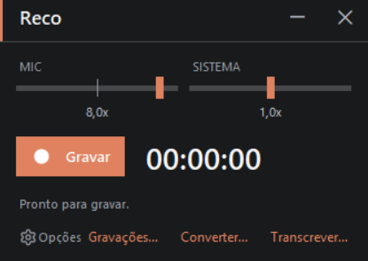

# Reco

**Record your microphone *and* your computer's audio at the same time, then transcribe it locally — with speaker separation.**

A small desktop app that captures the mic and the system output together
(real WASAPI loopback — no "Stereo Mix" needed), saves a compact MP3, and
transcribes it **on your machine**, labeling who said what. Nothing is uploaded.
The interface is available in English, Portuguese and Polish, auto-detected from your system.

Transcription runs in-process via **OpenVINO GenAI** on Windows/Linux (Intel
**iGPU → NPU → CPU**, auto-selected) and via **MLX** on macOS Apple Silicon — so
the bundled app is fully self-contained (no Python, no ffmpeg).

<p align="center">
  
</p>

---

## English

### Features
- 🎙️ **Mic + system audio together** — capture a call/meeting with both sides, via
  true WASAPI loopback (works even when "Stereo Mix" is disabled).
- 🗣️ **Channel diarization** — the mic and the system are kept on separate channels,
  so the transcript is labeled **"Eu" / "Me"** (you) and **"Interlocutor(es)" /
  "Speaker(s)"** (the other side). Always on.
- 🔇 **Echo cancellation** — if you're on speakers, the PC audio leaking into the
  mic is removed (offline adaptive filter using the loopback as reference), so the
  other party isn't duplicated across both channels.
- 📊 Live level meters for mic and system, each with a **draggable gain slider** —
  drag the handle over a meter to boost or attenuate what that channel records.
  Center is unity (**1.0×**, no change); left attenuates down to 0×, right boosts
  up to **10×**, and the current multiplier is shown under the bar. Handy when the
  mic records much quieter than the system audio. The gain is baked into the saved
  file and remembered between sessions.
- ⏸️ **Pause / resume** a recording before saving — paused time is dropped from the
  audio and from the clock, so a break doesn't end up in the file.
- 🔔 **Lives in the tray** — closing the window hides Reco into the notification area
  (a recording keeps running, and the icon shows a red dot with the elapsed time).
  **Hover** the icon to bring the compact window back over the tray (stop, start,
  convert, transcribe); **click** to pin it; **right-click** for Record/Stop,
  Pause/Resume, Open and Quit. Quitting mid-recording saves the MP3 first.
- 🎧 Saves a compact **MP3** (16 kHz stereo, 96 kbps — small, plenty for speech),
  encoded *while* recording, so stopping is instant no matter how long the meeting was.
- 📝 **Local transcription** that auto-saves a `.txt` next to your recordings. No
  cloud, fully private.
- 🔴 **Live transcription (draft)** — optional, off by default (Options): shows
  text as you record, on the iGPU. It's a *draft* — closed-segment (VAD-based),
  not a sliding window, so lines never rewrite themselves once they appear.
  When you stop, a final pass (same engine as regular transcription — channel
  diarization + echo cancellation + dominance) replaces the draft. **New** —
  try it on one of your own meetings before relying on it for a long recording.
- 🎵 **MP4 → MP3** — pick a video (or a heavy audio file) in the Transcribe view and
  hit *Extract MP3*: it re-encodes to the same lightweight format Reco records in
  (16 kHz mono, 64 kbps), typically a fraction of the original size. The MP3 is
  saved next to the source and stays selected, ready to transcribe.
- 🗂️ **Recordings library** — the *Recordings…* view lists everything in your
  recordings folder (date, length, transcript status) and searches by file
  name **and transcript content**. Play, transcribe, open the .txt or delete
  (to the Recycle Bin) from one place.
- ✦ **AI summary (optional)** — with [Claude Code](https://claude.com/claude-code)
  installed, one click turns a transcribed recording into `<name>.resumo.md`
  (summary, decisions, action items) using your local `claude` CLI. No API
  key, no cloud added to the app — and everything else works without it.
- 🌐 **Multilingual UI** (English, Portuguese and Polish), auto-detected, switchable in Options.
- 🎨 **Custom theme** — pick background and accent colors in Options; text contrast
  adjusts automatically. Frameless window with its own title bar.
- ▶️ Play back the last recording. Record and Transcribe are one-or-the-other views.

> Windows 10/11 (uses WASAPI). Recordings are saved to `Documents\Reco` (changeable in Options).

### Run from source
```powershell
pip install -r requirements.txt
python reco.py
```
Or run `./setup.ps1` to install the dependencies. The optional **Ctrl+Shift+R**
keyboard shortcut is *opt-in* — enable it inside Reco under **Options** (never
created automatically).

Required: `soundcard`, `numpy`, `av`, `scipy`, `huggingface_hub`.
Transcription backend: `openvino` + `openvino-genai` + `openvino-tokenizers`
(Windows/Linux), or `mlx-whisper` (macOS Apple Silicon).

### Build a standalone app
```powershell
./build.ps1 -Clean      # -> dist/Reco/Reco.exe  (folder, ~810 MB)
```
Onedir build: ship the whole **`dist/Reco/`** folder and run `Reco.exe` inside it.
It's **plug-n-play** — no Python, no ffmpeg, the OpenVINO runtime is bundled and
the VC++ runtime is included too. The **`small`** Whisper model ships in the
bundle as an offline fallback; the **default model is `large-v3-turbo`**, which
downloads (~0.8 GB) the first time you transcribe — no internet, no download,
and it uses `small` instead.

### How it works
- Capture uses `soundcard` (WASAPI): each physical device is listed once, mics and
  speakers are separated, and system audio is captured via real loopback.
- Recording is fixed at **16 kHz stereo** (L = mic, R = system), 96 kbps —
  exactly what transcription, diarization and echo cancellation need.
- Encoding and decoding both use PyAV (bundled ffmpeg libs). The MP3 is written
  as the audio arrives, so memory stays flat and stopping only flushes the file. Transcription uses Whisper
  **large-v3-turbo INT8** through OpenVINO GenAI (iGPU/NPU/CPU) or MLX (Apple
  GPU). The device defaults to the iGPU — measured fastest here: 2 h of audio in
  ~19 min end to end **with diarization on**, which transcribes both channels and
  so does twice the work (~10 min with it off). It is selectable, because the NPU
  is the better choice while you are on a video call: it barely notices
  concurrent load, where the iGPU competes with drawing the screen.
- The model is downloaded once (or bundled in the `.exe`) and cached locally.

### License
[MIT](LICENSE) © 2026 Gabriel dos Anjos

---

## Português

**Grave o microfone *e* o áudio do computador ao mesmo tempo e transcreva localmente — com separação de quem fala.**

Aplicativo de desktop que captura o microfone e a saída do sistema juntos
(loopback WASAPI de verdade — não precisa de "Mixagem estéreo"), salva um MP3
compacto e transcreve **na sua máquina**, identificando quem falou. Nada é enviado
para a nuvem. A interface está disponível em português, inglês e polonês, detectada pelo idioma do sistema.

A transcrição roda in-process via **OpenVINO GenAI** no Windows/Linux (Intel
**iGPU → NPU → CPU**, automático) e via **MLX** no macOS Apple Silicon — então o
app empacotado é autossuficiente (sem Python, sem ffmpeg).

### Recursos
- 🎙️ **Mic + áudio do sistema juntos** — grave uma reunião/chamada com os dois
  lados, via loopback WASAPI real (funciona mesmo sem "Mixagem estéreo").
- 🗣️ **Diarização por canal** — mic e sistema ficam em canais separados, então a
  transcrição é rotulada **"Eu"** (você) e **"Interlocutor(es)"** (o outro lado).
  Sempre ativa.
- 🔇 **Cancelamento de eco** — se você usa caixa de som, o áudio do PC que vaza para
  o microfone é removido (filtro adaptativo offline usando o loopback como
  referência), evitando que o interlocutor apareça duplicado nos dois canais.
- 📊 Barras de nível ao vivo para mic e sistema, cada uma com um **slider de ganho
  arrastável** — arraste o marcador sobre o medidor para aumentar ou reduzir o
  volume que aquele canal grava. O centro é o normal (**1,0×**, sem alteração); à
  esquerda atenua até 0× e à direita amplifica até **10×**, com o multiplicador
  atual mostrado embaixo da barra. Útil quando o microfone grava bem mais baixo
  que o áudio do sistema. O ganho é aplicado ao arquivo salvo e fica memorizado.
- ⏸️ **Pausar / continuar** a gravação antes de salvar — o tempo pausado não entra
  no áudio nem no cronômetro, então uma interrupção não vai parar no arquivo.
- 🔔 **Mora na bandeja** — fechar a janela recolhe o Reco para a área de notificação
  (a gravação continua, e o ícone ganha um ponto vermelho com o tempo decorrido).
  **Passe o mouse** sobre o ícone para trazer a janela compacta de volta sobre a
  bandeja (parar, gravar, converter, transcrever); **clique** para fixá-la;
  **botão direito** para Gravar/Parar, Pausar/Continuar, Abrir e Sair. Sair no meio
  de uma gravação salva o MP3 antes de encerrar.
- 🎧 Salva um **MP3** compacto (16 kHz estéreo, 96 kbps — pequeno e ótimo para fala),
  codificado *durante* a gravação: parar é instantâneo, não importa o tamanho da reunião.
- 📝 **Transcrição local** que salva um `.txt` automaticamente junto das gravações.
  Sem nuvem, 100% privado.
- 🔴 **Transcrição ao vivo (rascunho)** — opcional, desligada por padrão (Opções):
  mostra o texto conforme grava, na iGPU. É um *rascunho* — segmento fechado
  (por VAD), não janela deslizante: a linha nunca se reescreve depois de
  aparecer. Ao parar, uma passada final (o mesmo motor da transcrição normal —
  diarização por canal + cancelamento de eco + dominância) substitui o rascunho.
  **Novo** — teste numa reunião sua antes de confiar nele numa gravação longa.
- 🎵 **MP4 → MP3** — escolha um vídeo (ou um áudio pesado) na tela de Transcrição e
  clique em *Extrair MP3*: ele é reconvertido para o mesmo formato leve em que o
  Reco grava (16 kHz mono, 64 kbps), normalmente uma fração do tamanho original.
  O MP3 é salvo ao lado do arquivo de origem e já fica selecionado para transcrever.
- 🗂️ **Biblioteca de gravações** — a tela *Gravações…* lista tudo o que está na
  pasta de gravações (data, duração, estado da transcrição) e busca por nome
  do arquivo **e pelo conteúdo da transcrição**. Reproduzir, transcrever,
  abrir o .txt ou excluir (para a Lixeira) num lugar só.
- ✦ **Resumo por IA (opcional)** — com o [Claude Code](https://claude.com/claude-code)
  instalado, um clique transforma uma gravação transcrita em
  `<nome>.resumo.md` (resumo, decisões, pendências) usando o seu `claude`
  local. Sem chave de API, sem nuvem no app — e todo o resto funciona sem ele.
- 🌐 **Interface em três idiomas** (português, inglês e polonês), detectada automaticamente, troca em Opções.
- 🎨 **Tema personalizável** — escolha as cores de fundo e de destaque em Opções; o
  contraste do texto se ajusta sozinho. Janela sem moldura, com barra própria.
- ▶️ Reproduza a última gravação. Gravar e Transcrever são telas alternadas (uma ou outra).

> Apenas Windows 10/11 (usa WASAPI). As gravações vão para `Documentos\Reco` (mudável nas Opções).

### Rodar pelo código-fonte
```powershell
pip install -r requirements.txt
python reco.py
```
Ou rode `./setup.ps1` para instalar as dependências. O atalho **Ctrl+Shift+R** é
*opcional* — ative dentro do Reco em **Opções** (nunca é criado automaticamente).

Obrigatórias: `soundcard`, `numpy`, `av`, `scipy`, `huggingface_hub`.
Backend de transcrição: `openvino` + `openvino-genai` + `openvino-tokenizers`
(Windows/Linux), ou `mlx-whisper` (macOS Apple Silicon).

### Gerar um app independente
```powershell
./build.ps1 -Clean      # -> dist/Reco/Reco.exe  (pasta, ~810 MB)
```
Build onedir: distribua a pasta **`dist/Reco/`** inteira e rode o `Reco.exe` de
dentro dela. É **plug-n-play** — sem Python, sem ffmpeg; o runtime do OpenVINO
vai embutido, e o runtime do VC++ também está incluso. O modelo Whisper
**`small`** vai no bundle como fallback offline; o **modelo padrão é o
`large-v3-turbo`**, que baixa (~0,8 GB) na primeira transcrição — sem internet,
sem download, e usa o `small` no lugar.

### Como funciona
- A captura usa `soundcard` (WASAPI): cada dispositivo físico aparece uma vez, mics
  e alto-falantes são separados, e o áudio do sistema é capturado por loopback real.
- A gravação é fixa em **16 kHz estéreo** (L = mic, R = sistema), 96 kbps —
  exatamente o que transcrição, diarização e cancelamento de eco precisam.
- Codificação e decodificação usam PyAV (libs do ffmpeg embutidas). O MP3 é escrito
  conforme o áudio chega, então a memória fica estável e parar só fecha o arquivo. A transcrição usa o Whisper
  **large-v3-turbo INT8** via OpenVINO GenAI (iGPU/NPU/CPU) ou MLX (GPU Apple). O
  device vem na iGPU — medida como a mais rápida aqui: 2 h de áudio em ~19 min
  ponta a ponta **com diarização ligada**, que transcreve os dois canais e portanto
  faz o dobro do trabalho (~10 min sem ela). É selecionável, porque a NPU é a
  melhor escolha durante uma videochamada: ela quase não sente carga concorrente,
  enquanto a iGPU disputa com o desenho da tela.
- O modelo é baixado uma vez (ou embutido no `.exe`) e fica em cache local.

Scripts de apoio em `tools/` (rodam pelo fonte, não entram no executável): ver
[docs/TOOLS.md](docs/TOOLS.md).

### Licença
[MIT](LICENSE) © 2026 Gabriel dos Anjos

---

## Polski

**Nagrywaj mikrofon *i* dźwięk komputera jednocześnie, a potem transkrybuj lokalnie — z rozdzieleniem mówców.**

Aplikacja desktopowa, która przechwytuje mikrofon i dźwięk systemowy jednocześnie
(prawdziwy loopback WASAPI — bez potrzeby „Miksu stereo"), zapisuje kompaktowy MP3
i transkrybuje **na Twoim komputerze**, oznaczając, kto co powiedział. Nic nie trafia
do chmury. Interfejs jest dostępny w trzech językach (polskim, angielskim i
portugalskim), rozpoznawanych automatycznie po języku systemu.

Transkrypcja działa in-process przez **OpenVINO GenAI** w Windows/Linux (Intel
**iGPU → NPU → CPU**, wybierane automatycznie) oraz przez **MLX** na macOS z Apple
Silicon — dzięki temu spakowana aplikacja jest w pełni samowystarczalna (bez
Pythona, bez ffmpeg).

### Funkcje
- 🎙️ **Mikrofon i dźwięk systemowy jednocześnie** — nagraj spotkanie/rozmowę z obiema
  stronami przez prawdziwy loopback WASAPI (działa nawet bez „Miksu stereo").
- 🗣️ **Diaryzacja kanałowa** — mikrofon i system zapisywane są na osobnych kanałach,
  więc transkrypcja rozróżnia **Ciebie** i **rozmówców** (etykiety zależą od języka
  interfejsu, np. „Ja" / „Rozmówca(y)" po polsku). Zawsze aktywna.
- 🔇 **Redukcja echa** — gdy słuchasz przez głośniki, dźwięk komputera przedostający
  się do mikrofonu jest usuwany (offline'owy filtr adaptacyjny korzystający z
  loopbacku jako sygnału odniesienia), więc rozmówca nie pojawia się zdublowany na
  obu kanałach.
- 📊 Wskaźniki poziomu na żywo dla mikrofonu i systemu, każdy z **przesuwanym suwakiem
  wzmocnienia** — przeciągnij uchwyt po wskaźniku, aby podbić lub przyciszyć to, co
  rejestruje dany kanał. Środek to wartość neutralna (**1,0×**, bez zmian); w lewo
  ścisza do 0×, w prawo wzmacnia do **10×**, a aktualny mnożnik jest widoczny pod
  paskiem. Przydatne, gdy mikrofon nagrywa znacznie ciszej niż dźwięk systemowy.
  Wzmocnienie trafia do zapisywanego pliku i jest zapamiętywane między sesjami.
- ⏸️ **Wstrzymaj / wznów** nagrywanie przed zapisaniem — czas pauzy nie trafia ani do
  audio, ani do zegara, więc przerwa nie wyląduje w pliku.
- 🔔 **Mieszka w zasobniku** — zamknięcie okna chowa Reco do obszaru powiadomień
  (nagrywanie trwa dalej, a ikona otrzymuje czerwoną kropkę z upływającym czasem).
  **Najedź kursorem** na ikonę, aby przywrócić kompaktowe okno nad zasobnik (stop,
  start, konwersja, transkrypcja); **kliknięcie** przypina je; **prawy przycisk** daje
  Nagrywaj/Zatrzymaj, Wstrzymaj/Wznów, Otwórz i Zakończ. Zakończenie w trakcie
  nagrywania najpierw zapisuje MP3.
- 🎧 Zapisuje kompaktowy **MP3** (16 kHz stereo, 96 kbps — mały, w zupełności
  wystarczający dla mowy), kodowany *w trakcie* nagrywania: zatrzymanie jest
  natychmiastowe, niezależnie od tego, jak długie było spotkanie.
- 📝 **Lokalna transkrypcja**, która automatycznie zapisuje `.txt` obok nagrań.
  Bez chmury, w 100% prywatne.
- 🔴 **Transkrypcja na żywo (szkic)** — opcjonalna, domyślnie wyłączona (Opcje):
  pokazuje tekst w miarę nagrywania, na iGPU. To *szkic* — segmenty domykane
  (oparte na VAD), a nie okno przesuwne, więc linia nigdy nie przepisuje się po
  pojawieniu. Po zatrzymaniu finalny przebieg (ten sam silnik co w zwykłej
  transkrypcji — diaryzacja kanałowa + redukcja echa + dominancja) zastępuje szkic.
  **Nowość** — wypróbuj na jednym ze swoich spotkań, zanim zaufasz temu przy długim
  nagraniu.
- 🎵 **MP4 → MP3** — wybierz film (lub „ciężki" plik audio) w widoku Transkrypcji i
  kliknij *Konwertuj na MP3*: plik zostaje przekodowany do tego samego lekkiego
  formatu, w którym nagrywa Reco (16 kHz mono, 64 kbps) — zwykle to ułamek
  pierwotnego rozmiaru. MP3 zapisuje się obok pliku źródłowego i pozostaje
  zaznaczony, gotowy do transkrypcji.
- 🗂️ **Biblioteka nagrań** — widok *Nagrania…* wypisuje wszystko z folderu nagrań
  (data, długość, stan transkrypcji) i przeszukuje po nazwie pliku **oraz treści
  transkrypcji**. Odtwarzanie, transkrypcja, otwarcie `.txt` czy usunięcie (do Kosza)
  w jednym miejscu.
- ✦ **Podsumowanie AI (opcjonalne)** — z zainstalowanym
  [Claude Code](https://claude.com/claude-code) jedno kliknięcie zamienia
  ztranskrybowane nagranie w `<nazwa>.resumo.md` (podsumowanie, decyzje, zadania do
  wykonania) przy użyciu lokalnego `claude` CLI. Bez klucza API, bez dodatkowej
  chmury — a cała reszta działa bez niego.
- 🌐 **Interfejs w trzech językach** (polski, angielski, portugalski), rozpoznawany
  automatycznie, zmiana w Opcjach.
- 🎨 **Własny motyw** — wybierz kolory tła i akcentu w Opcjach; kontrast tekstu
  dostosowuje się sam. Okno bez ramki, z własnym paskiem tytułu.
- ▶️ Odtwórz ostatnie nagranie. Nagrywanie i Transkrypcja to naprzemienne widoki
  (jeden albo drugi).

> Windows 10/11 (używa WASAPI). Nagrania trafiają do `Dokumenty\Reco` (do zmiany w Opcjach).

### Uruchomienie ze źródeł
```powershell
pip install -r requirements.txt
python reco.py
```
Albo uruchom `./setup.ps1`, aby zainstalować zależności. Opcjonalny skrót
**Ctrl+Shift+R** jest *opt-in* — włącz go w aplikacji Reco w **Opcjach** (nigdy
nie jest tworzony automatycznie).

Wymagane: `soundcard`, `numpy`, `av`, `scipy`, `huggingface_hub`.
Backend transkrypcji: `openvino` + `openvino-genai` + `openvino-tokenizers`
(Windows/Linux) albo `mlx-whisper` (macOS Apple Silicon).

### Zbudowanie samodzielnej aplikacji
```powershell
./build.ps1 -Clean      # -> dist/Reco/Reco.exe  (folder, ~810 MB)
```
Build onedir: dystrybuuj cały folder **`dist/Reco/`** i uruchom `Reco.exe` wewnątrz
niego. To **plug-n-play** — bez Pythona, bez ffmpeg; runtime OpenVINO jest w pakiecie,
a runtime VC++ również jest dołączony. Model Whisper **`small`** jest w pakiecie jako
fallback offline; **domyślnym modelem jest `large-v3-turbo`**, który przy pierwszej
transkrypcji pobiera się (~0,8 GB) — bez internetu nie ma pobierania i używa wtedy
`small`.

Na maszynie z Linuksem przenośną wersję na Windows można zbudować bez Windowsa:
`./build-win-portable.sh` uruchamia ten sam build (PyInstaller + model) przez Wine
i pakuje wynik do `dist/Reco-portable-win11-x64.zip`.

### Jak to działa
- Przechwytywanie wykorzystuje `soundcard` (WASAPI): każde fizyczne urządzenie pojawia
  się na liście raz, mikrofony i głośniki są rozdzielone, a dźwięk systemowy jest
  przechwytywany przez prawdziwy loopback.
- Nagrywanie ma ustalone **16 kHz stereo** (L = mikrofon, R = system), 96 kbps —
  dokładnie to, czego potrzebują transkrypcja, diaryzacja i redukcja echa.
- Kodowanie i dekodowanie realizuje PyAV (dołączone biblioteki ffmpeg). MP3 jest
  zapisywany w miarę napływania dźwięku, więc zużycie pamięci pozostaje stabilne, a
  zatrzymanie jedynie domyka plik. Transkrypcja używa Whispera
  **large-v3-turbo INT8** przez OpenVINO GenAI (iGPU/NPU/CPU) lub MLX (GPU Apple).
  Domyślnie wybrana jest iGPU — zmierzona tu jako najszybsza: 2 h audio w ~19 min od
  początku do końca **z włączoną diaryzacją**, która transkrybuje oba kanały i przez
  to wykonuje podwójną pracę (~10 min bez niej). Urządzenie można wybrać, bo NPU
  sprawdza się lepiej podczas wideorozmowy: prawie nie odczuwa równoległego
  obciążenia, podczas gdy iGPU konkurowałoby z rysowaniem obrazu.
- Model jest pobierany raz (albo dołączony do `.exe`) i przechowywany w lokalnym cache.

Skrypty pomocnicze w `tools/` (uruchamiane ze źródeł, nie trafiają do pliku
wykonywalnego): zobacz [docs/TOOLS.md](docs/TOOLS.md).

### Licencja
[MIT](LICENSE) © 2026 Gabriel dos Anjos
